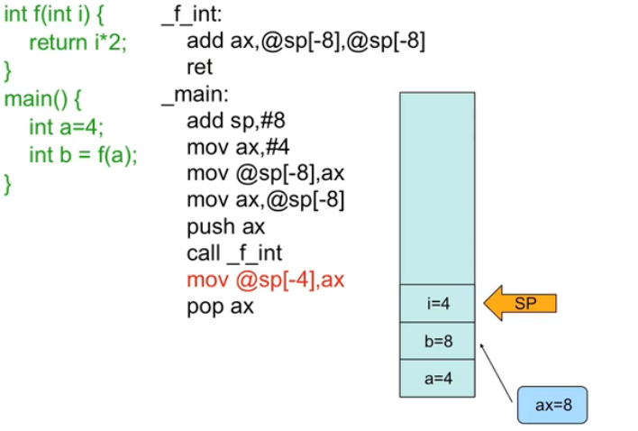

# hello world
## hello

*斜体*，**加粗**，**加粗**
***
代码段落：

    int main(){
    std::cout <<"hello,world"<<std::endl;
    return 0;
    }
***
#### 区别 Declaration  Definition

命令行cpp指令：保存编译中的临时文件
`g++ a.cpp b.cpp --save-temps `

编译过程：
首先每个cpp进行编译预处理，将每一个头文件内容插进来。然后每个cpp单独作编译、最后一起链接起来

1.编译预处理（#）输出文件后缀 ——.ii
2.编译器输出后缀 ——.s
3.汇编器输出后缀 ——.o
4.链接器：把所有的cpp.o文件连接到一起——.out
\
\
头文件里放定义容易出现重定义问题！
头文件函数的声明：输出类型、函数名、输入类型（缺省值）
变量的声明：变量类型、变量名、
\
\
本地变量  成员变量  this指针
类中包含变量的**声明**和函数的**定义**
{}开始时分配空间
default constructor无参数的构造函数

new、new[]、delete、delete[]分配空间、调用构造，输入输出、区别
new出来的空间在哪里？

析构==空间回收？
***
初始化列表早于构造函数执行,在输入为对象时有区别，会调用默认的输入对象的构造函数
    
    构造函数：Point(float xa=0.0,float ya=0.0)
                  :y(ya),x(xa){}

面向对象三大特性：**封装**、**继承**和**多态性**
C++提供复杂的内存模型：fully inclusion、by reference，雇员的例子
java只能By reference

构造子类的对象时有时必须调用父类的**非默认**构造函数，需要在初始化列表中初始化

函数的重载（Overloading）

继承中的名字隐藏问题（Name Hidding），无法重载函数（全局、局部变量有作用域、函数也有**作用域**）
如何调用父类中被隐藏的函数？

函数的缺省值写在哪里？

调用函数开销很大，大在哪里？ inline函数的实施过程

const指针、const变量、const函数如何表示、什么意思？
在头文件中函数后有const什么意思？
const和非const可以构成重载（输入指针不一样）
**const类型必须在初始化时赋值！！**
const类型变量能不能做左值？
以下几种指针的区别：
`const int *p = 8;`
`int* const p = &a;`
`const int * const  p = &a;`

补充内容：
左值(locator value，lvalue)：存储在内存中、有明确存储地址（可寻址）的数据
右值(read value，rvalue)：提供数据值的数据（不一定可以寻址，例如存储于寄存器中的数据）eg:函数返回值、临时计算值

    #include <iostream>
    using namespace std;
    class A {
        const int i;
    public:
        A():i(0){}
        void f() { cout <<"f()"<< endl;}
        void f()const { cout <<"f() const" << endl;}
    };
    int main(){
        const A a;
        a.f();          //输出f() const
        return 0;
    }
***
引用

    char c;
    char* p = &c;
    char& r = c;
本质使用const指针实现的。为了减少*号。引用也会分配存储空间，用于保存被引用变量的地址,引用的地址==被引变量的地址
向上构型

    Manager是Employee的子类，可以被当作employee看待
    Manager pete("Pete"，"444-55-6666""Bakery")
    Employee* ep = &pete; // Upcast
    Employee& er = pete; // Upcast

C++中默认静态绑定，但virtual用于进行函数的动态绑定（改写/覆盖Overiding）
virtual实现动态绑定的定义：指针及引用、原理：vptr指针、vtable；有virtual的对象内存如何？
Overloading和Overriding同时存在的情况？
**&取地址**
**对象的地址就是对象第一个字段的地址**

    A a,b;
    A* p = &a;
    int* p = (int*)&a;      //vptr
    int* q = (int*)&b;
    那么*p == *q？

    //不同赋值的区别
    Shape a;                //父类
    Ellipse b;              //子类
        a = b;                
        a.render();         //调用的是父类还是子类的render函数？
    
        Shape* a = &b;
        a->render();         //调用的是父类还是子类的函数？点调用与指针调用有区别吗？       

        int* p = (int*)a;
        int* q = (int*)b;
        *p = *q;
        a.render();         //调用的是父类还是子类的函数？
        p = q;
        a.render();         //调用的是父类还是子类的函数？ 

补充内容：
对象的**函数**和**静态变量**储存在公共代码区，通过this指针访问
对象的**一般变量**储存在堆栈中，与对象共生死，所以对象大小基本就是变量大小之和。
虚继承类产生的对象的内存中除了一般变量，还包含**vptr**

***
地址的强制转换：（int*）
整型变量、对象、字符变量、字符串变量指针大小为多少？

引用的再研究：
**用于函数传参**：`Person(const string& name, int weight)`,哪些好处？
用于函数输出：

拷贝构造
**初始化**（initialization）和**赋值**（assignment）的区别
可以用哪两种方式表示初始化？
拷贝构造函数在什么时候被调用？
标准形式：`Person(const Person& a)`
深拷贝和浅拷贝
编译器会优化掉不必要的拷贝

    Person f()
    {
        Person ip;
        return ip;
    }
    Person a = f();     //只拷贝一次

C++中Static关键字的两个含义：长储存、处处可访问
C++中的内存分区：

静态本地对象：在定义时进行初始化
条件的静态对象：需要有一个条件的析构函数
全局静态变量：在链接时分配内存，并执行，在main函数前
当不同cpp文件的静态变量初始化存在依赖关系时，应该怎么做？

**声明/定义 需要严格区分**
静态成员是属于类的还是对象的？
静态成员变量在哪里声明，在哪里定义？
类的静态成员变量与静态变量的声明、定义有何区别？作用范围？
静态成员如何访问？

静态成员函数的注意事项：不能调用对象的属性、返回值为静态变量
**什么是初始化？**

    class A
    {
    public:
        A(){ i=0 }
        A():i(10){}                     //报错，Why？
        void print() { cout << i << endl; }
        void set(int ii) { i = ii;}
    private:
        static int i;
    }

    int A::i;                        //定义静态成员变量
    int A::i = 10；                  //初始化
    main(){
        A a,b;
        a.set(10);
        b.print();
        return 0;
    }
***
**运算符重载**

作用于**对象**
哪些运算符不可以重载？4个
全局运算符重载、成员函数的运算符重载
`const String operation + (const String& r, const String& l)`
`const String String::operator + (const String& that)` 隐藏的变量this
\
\
Receiver、Type conversion? 哪些时候需要进行类型转换？
`z = x + y`
`z = x + 3`
`z = 3 + x`

C++中的自动类型转换有哪些？？？

重载中的三种const分别有什么意义？
根据不同的运算符使用相应的const

运算符函数的原型：小于、等于

    bool Integer::operator==( const Integer& rhs ) const {
        return i == rhs.i;
    }
    bool Integer::operator<( const Integer& rhs ) const {
        return i < rhs.i;
    }

\
**模板**
模板规则很严格，不考虑implicit conversion
模板类、类模板、模板函数、函数模板
模板函数的重载问题

函数模板的声明：

    Template<class T，......>
    void swap(T& a,T& b){
        T temp = a;
        a = b;
        b = temp;
    }

模板类函数的使用：
`int a; int b; foo(a,b);`
`foo<int>(a,b);`

**异常抛出**
throw沿着调用顺序，不断将问题抛出，直到有catch抓住

    template <class T>
    T& Vector<T>::operator{
        if (indx < 0 l indx >= m size) {
            // VectorIndexError e(indx);
            // throw e;
            throw VectorIndexError(indx);     // 抛出异常的那个index
        }
        return m elements[indx];
    }

    int func() {
        Vector<int> v(12);
        v[3]=5;
        int i = v[42]; // 越界了
        return i * 5;
    }
    void outer() {
        try {
            func(); func2();
        } catch (VectorIndexError& e) {
            e.diagnostic();                 // 处理异常
            throw；                         // 用于层层抛出异常
        }
        cout << "Control is here after exception";
        catch(...){
            cout << "catch All exceptions";     // 捕捉所有异常
        }
    }

***
流：一维单方向

STL库
容器：Vector、Deque、List、Set、Map（key-value）
算法：sort、search···
迭代器（iterator）
     

